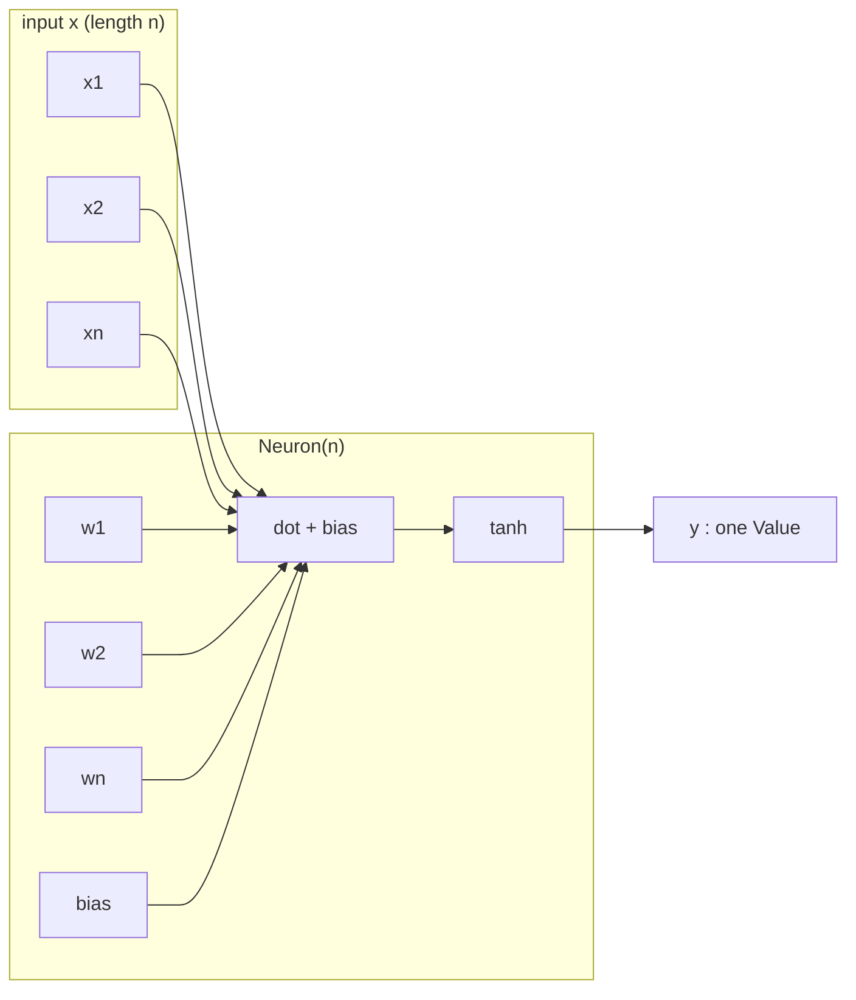
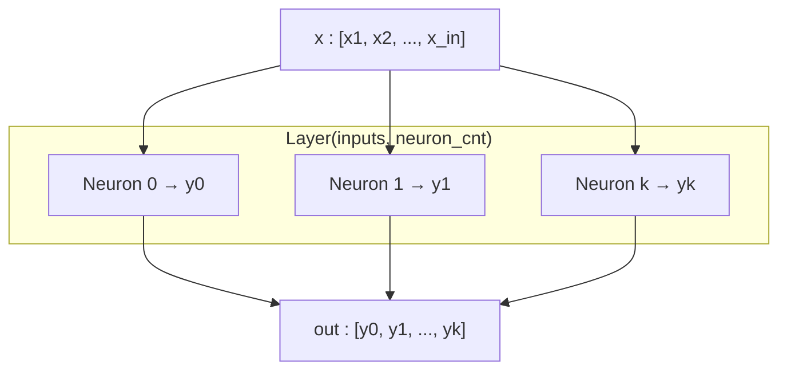
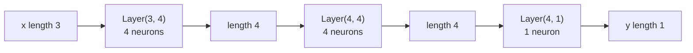

# 🧠 C-grad

A minimalistic, educational implementation of a scalar-based automatic differentiation engine and a small neural network library built on top of it — all in pure C++.
- Operates on **scalar values only**, meaning each neuron is broken down into primitive operations like tiny adds and multiplies.
- Despite its simplicity, this system can build and train full deep neural networks for classification / regression problems as well.
- Inspired from Andrej Karpathy's Micrograd

---

## Project layout

Headers declare the public API; `.cpp` files hold the implementations.

```
Autograd/
  Value.hpp / Value.cpp     # scalar autodiff node and arithmetic
  Neuron.hpp / Neuron.cpp   # tanh neuron
  Layer.hpp / Layer.cpp     # dense layer of neurons
  MLP.hpp / MLP.cpp         # stacked layers
  test.cpp                  # example checks (uncomment in main)
Makefile
```

Build from the repo root:

```bash
make
./Autograd/test
```

---

## ✨ Features

- **Autograd Engine**: Supports reverse-mode automatic differentiation.
- **Value Class**: Tracks operations and computes gradients.
- **Neural Network API**: Includes `Neuron`, `Layer`, and `MLP` abstractions.
- **Backpropagation**: Fully functional backward pass with graph traversal.
- **Educational**: Easy to understand and extend for learners.

---

## How Neuron, Layer, and MLP are built

Everything is stacked from the same scalar type: a `Value` is one number that remembers how it was computed so gradients can flow backward.

```
Value  →  Neuron  →  Layer  →  MLP
scalar    one unit    a row of     stacked
          tanh        neurons      layers
```

### 1. `Value` — one number in the graph

A leaf `Value` is an input, a constant, or a trainable parameter (`_data` + `_grad`). Arithmetic (`+`, `*`, `tanh`, …) creates new `Value`s that point at their parents. The network classes below only compose these nodes; they do not invent a separate tensor type.

### 2. `Neuron` — one tanh unit

**Constructor:** `Neuron(n)` where `n` is the number of incoming features.

**Owns:** `n` weights and `1` bias, each a leaf `Value` (random in `[-1, 1]`).

**Forward:** `vector<Value>` of length `n` → **one** `Value`.

```
y = tanh( w1*x1 + w2*x2 + ... + wn*xn + b )
```



`parameters()` returns `{w1, …, wn, b}` so training can zero grads and step them.

### 3. `Layer` — several neurons, same input

**Constructor:** `Layer(inputs, neuron_cnt)`

| Argument | Meaning |
|---|---|
| `inputs` | Fan-in of **each** neuron (length of `x`) |
| `neuron_cnt` | How many neurons sit side by side (width of the layer) |

Internally: `neuron_cnt` copies of `Neuron(inputs)`. Every neuron sees the **same** `x` and produces its own scalar. Those scalars are concatenated.

**Forward:** `vector<Value>` of length `inputs` → `vector<Value>` of length `neuron_cnt`.



Example: `Layer(3, 4)` is 3 inputs → 4 tanh neurons → 4 outputs.

### 4. `MLP` — layers wired in sequence

**Constructor:** `MLP(input_size, layers_size)`

| Argument | Meaning |
|---|---|
| `input_size` | Length of the network's first input vector |
| `layers_size` | Neuron count of **each** layer, **including** the output layer |

The i-th layer is built as `Layer(sz[i], sz[i+1])` where `sz = [input_size] + layers_size`. So each layer's width becomes the next layer's fan-in.

**Forward:** feed `x` into layer 0, take that output as the next input, repeat. Return the last layer's vector.



That diagram is exactly:

```cpp
MLP n = MLP(3, {4, 4, 1});  // 3 → 4 → 4 → 1
```

| Layer | Constructed as | In | Out |
|---|---|---|---|
| hidden 1 | `Layer(3, 4)` | 3 | 4 |
| hidden 2 | `Layer(4, 4)` | 4 | 4 |
| output | `Layer(4, 1)` | 4 | 1 |

`n(x)` therefore expects `x.size() == 3` and returns a vector of size `1`. `parameters()` flattens every layer's weights and biases for the training loop.

### Mental model

- **Neuron** = one weighted sum + tanh (scalar out).
- **Layer** = many neurons in parallel (vector out).
- **MLP** = layers in series (each output vector is the next input).
- Training: forward → MSE loss as a `Value` → `loss->backward()` → step every `parameters()` entry.

---

## Example Usage
Below is a slightly contrived example showing a number of possible supported operations:

``` bash

    std::cout << "--- Simple Test ---" << std::endl;

    auto a = make_shared<Value>(-4.0);
    auto b = make_shared<Value>(2.0);

    auto c = a + b;
    auto d = a * b + b->power(3);

    c = c + c + 1;
    c = c + 1 + c + (-a);

    d = d + d * 2 + (b + a) -> relu();
    d = d + 3 * d + (b - a)->relu();

    auto e = c - d;
    auto f = e -> power(2);

    auto g = f / 2;
    g = g + 10/f;

    auto ee = a -> exp();
    auto tt = a -> tanh();
    auto rr = a -> relu();


    cout << "Forward Pass \n";
    cout <<"G : " <<  g -> _data << '\n';   // prints 24.7041,

    cout << "---------Backward Pass-----------\n";
    g -> backward();

    cout << "dg/da : " << a -> _grad << '\n';  // prints 138.8338, i.e. the numerical value of dg/da
    cout << "dg/db : " << b -> _grad << '\n';  // prints 645.5773, i.e. the numerical value of dg/db

```


## Training a Neural Net
The test.cpp provides a full demo of training an 2-layer neural network (MLP) with 2 hidden layers each of 4 nodes with sample inputs and desired outputs.This is achieved by initializing a neural net from MLP class and implementing a custom TanH activation function.

``` bash

        MLP n = MLP(3, {4, 4, 1});

    // sample training
    vector < vector < shared_ptr < Value> > > xs = {{make_shared<Value>(2.0), make_shared<Value>(3.0), make_shared<Value>(-1.0)}, 
{make_shared<Value>(3.0), make_shared<Value>(-1.0), make_shared<Value>(0.5)},
{make_shared<Value>(0.5), make_shared<Value>(1.0), make_shared<Value>(1.0)},
{make_shared<Value>(1.0), make_shared<Value>(1.0), make_shared<Value>(-1.0)}};

     vector < shared_ptr<Value> > ys = {make_shared<Value>(1.0), make_shared<Value>(-1.0), make_shared<Value>(-1.0), make_shared<Value>(1.0)};

     
    //optimisation
    double lr = 0.05;   // learning rate

    for (int step = 0; step < 5; ++step){

        //forward pass
        vector < shared_ptr<Value > > y_pred;

        for(int i = 0; i < xs.size(); ++i){
            auto x = xs[i];
            auto y = n(x)[0];
            y_pred.push_back(y);

        }

        auto loss = make_shared<Value>(0.0);

        for(int i = 0; i < xs.size(); ++i){
            loss = loss + (ys[i] - y_pred[i]) * (ys[i] - y_pred[i]);
        }

        //change grads to 0
        for(int i = 0; i < n.parameters().size(); ++i){
            n.parameters()[i] -> _grad = 0.0;
        }

        //backward pass
        loss -> backward();

        //update the parameters
        for(int i = 0; i < n.parameters().size(); ++i){
            n.parameters()[i] -> _data += lr * -n.parameters()[i] -> _grad;
        }

        cout << "Loss : " << loss -> _data << "\n";

        cout << "Predictions : \n";

        for(int i = 0; i < xs.size(); ++i){
            cout << y_pred[i] -> _data << " " << ys[i] -> _data << '\n';
        }
    }

```
